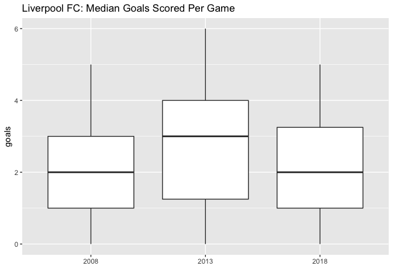
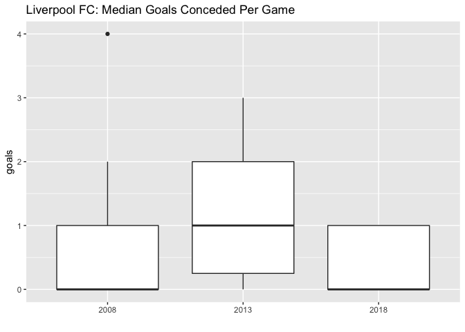

Liverpool League Comparison
================
Ryan Estrellado
12/26/2018

``` r
library(tidyverse) 
library(googlesheets)
library(knitr)
```

``` r
# Install `engsoccerdata` from GitHub
# library(devtools)
# install_github('jalapic/engsoccerdata', username = "jalapic")
library(engsoccerdata)
```

``` r
# Load England data
england <- as.tibble(england)
```

``` r
# Subset Liverpool results 
lfc_past <- england %>% 
  filter(Season %in% c(2008, 2013, 2018), 
         home == "Liverpool" | visitor == "Liverpool") %>% 
  select(-c(FT, division, tier, totgoal, goaldif)) %>% 
  mutate(points = 0, 
         # Home wins
         points = ifelse(home == "Liverpool" & result == "H", 3, points), 
         # Away wins
         points = ifelse(visitor == "Liverpool" & result == "A", 3, points), 
         # Draws
         points = ifelse(result == "D", 1, points)) 
```

2018-2019 data is updated and stored in a [Google Sheet](%22https://docs.google.com/spreadsheets/d/1xLXf6uISIuYE2SOAA267-PBpTlO-11AZrmDJsjq4M_c/edit?usp=sharing%22)

``` r
# Read in 2018-2019 data 
key <- extract_key_from_url("https://docs.google.com/spreadsheets/d/1xLXf6uISIuYE2SOAA267-PBpTlO-11AZrmDJsjq4M_c/edit?usp=sharing") 

lfc_18 <- gs_key(key) %>% 
  gs_read()
```

    ## Sheet successfully identified: "lfc_2018_2019"

    ## Accessing worksheet titled 'Sheet1'.

    ## Parsed with column specification:
    ## cols(
    ##   Date = col_date(format = ""),
    ##   Season = col_integer(),
    ##   home = col_character(),
    ##   visitor = col_character(),
    ##   hgoal = col_integer(),
    ##   vgoal = col_integer(),
    ##   result = col_character()
    ## )

``` r
lfc_18 <- lfc_18 %>% 
  mutate(result = "D",
         result = ifelse(home == "Liverpool" & hgoal > vgoal, "H", result), 
         result = ifelse(visitor == "Liverpool" & hgoal < vgoal, "A", result), 
         points = 0, 
         # Home wins
         points = ifelse(home == "Liverpool" & result == "H", 3, points), 
         # Away wins
         points = ifelse(visitor == "Liverpool" & result == "A", 3, points), 
         # Draws
         points = ifelse(result == "D", 1, points)) 
```

``` r
# Combine all seasons
lfc <- bind_rows(lfc_past, lfc_18) %>% 
  arrange(Date)
```

``` r
# Write dataset. This updates in data.world
write_csv(lfc, "output/lfc_title_challenge.csv")
```

``` r
# Plot point total across games 
lfc %>% 
  group_by(Season) %>%
  mutate(game = 1:length(Season), 
         cum_points = cumsum(points)) %>%
  ungroup() %>% 
  ggplot(data = ., aes(x = game, y = cum_points, group = as.character(Season))) + 
  geom_freqpoly(stat = "identity", aes(color = as.character(Season)), size = 1) + 
  labs(title = "Comparison of Point Totals", 
       color = "Season", 
       x = "Game", 
       y = "Points")
```


Compare Goals Scored Across Seasons
-----------------------------------

``` r
# Transform dataset 
home_goals <- lfc %>% 
  filter(home == "Liverpool") %>% 
  mutate(home_away = "home") %>% 
  select(Date, Season, oppo = visitor, home_away, goals = hgoal)

away_goals <- lfc %>% 
  filter(visitor == "Liverpool") %>% 
  mutate(home_away = "visitor") %>% 
  select(Date, Season, oppo = home, home_away, goals = vgoal)

# Make combined home and away dataset 
lfc_goals <- bind_rows(home_goals, away_goals) %>% 
  mutate_at(vars(Season, oppo, home_away), funs(as.factor))
```

``` r
# Model goals per game
model_goals <- lm(goals ~ Season, data = lfc_goals)
summary(model_goals)
```

    ## 
    ## Call:
    ## lm(formula = goals ~ Season, data = lfc_goals)
    ## 
    ## Residuals:
    ##     Min      1Q  Median      3Q     Max 
    ## -2.6579 -1.0263 -0.0263  0.9737  3.3421 
    ## 
    ## Coefficients:
    ##             Estimate Std. Error t value Pr(>|t|)    
    ## (Intercept)   2.0263     0.2357   8.597 1.89e-13 ***
    ## Season2013    0.6316     0.3333   1.895   0.0612 .  
    ## Season2018    0.3737     0.4014   0.931   0.3543    
    ## ---
    ## Signif. codes:  0 '***' 0.001 '**' 0.01 '*' 0.05 '.' 0.1 ' ' 1
    ## 
    ## Residual standard error: 1.453 on 93 degrees of freedom
    ## Multiple R-squared:  0.03742,    Adjusted R-squared:  0.01672 
    ## F-statistic: 1.808 on 2 and 93 DF,  p-value: 0.1698

Compare Goals Conceded Across Seasons
-------------------------------------

``` r
# Transform dataset 
home_goals_c <- lfc %>% 
  filter(home == "Liverpool") %>% 
  mutate(home_away = "home") %>% 
  select(Date, Season, oppo = visitor, home_away, goals = vgoal)

away_goals_c <- lfc %>% 
  filter(visitor == "Liverpool") %>% 
  mutate(home_away = "visitor") %>% 
  select(Date, Season, oppo = home, home_away, goals = hgoal)

# Make combined home and away dataset 
lfc_goals_c <- bind_rows(home_goals_c, away_goals_c) %>% 
  mutate_at(vars(Season, oppo, home_away), funs(as.factor))
```

``` r
ggplot(data = lfc_goals, aes(x = Season, y = goals)) + 
  geom_boxplot() + 
  labs(title = "Liverpool FC: Median Goals Scored Per Game", 
       x = "")
```



``` r
# Model goals per game
model_goals_c <- lm(goals ~ Season, data = lfc_goals_c)
summary(model_goals_c)
```

    ## 
    ## Call:
    ## lm(formula = goals ~ Season, data = lfc_goals_c)
    ## 
    ## Residuals:
    ##     Min      1Q  Median      3Q     Max 
    ## -1.3158 -0.7105 -0.3158  0.6000  3.2895 
    ## 
    ## Coefficients:
    ##             Estimate Std. Error t value Pr(>|t|)    
    ## (Intercept)   0.7105     0.1474   4.819  5.6e-06 ***
    ## Season2013    0.6053     0.2085   2.903  0.00462 ** 
    ## Season2018   -0.3105     0.2511  -1.237  0.21930    
    ## ---
    ## Signif. codes:  0 '***' 0.001 '**' 0.01 '*' 0.05 '.' 0.1 ' ' 1
    ## 
    ## Residual standard error: 0.9089 on 93 degrees of freedom
    ## Multiple R-squared:  0.1439, Adjusted R-squared:  0.1255 
    ## F-statistic: 7.816 on 2 and 93 DF,  p-value: 0.0007285

``` r
ggplot(data = lfc_goals_c, aes(x = Season, y = goals)) + 
  geom_boxplot() + 
  labs(title = "Liverpool FC: Median Goals Conceded Per Game", 
       x = "")
```


