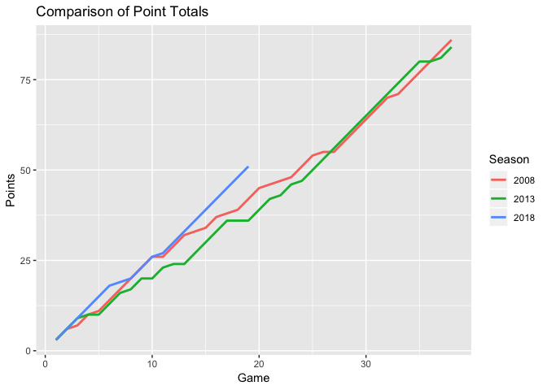

Liverpool League Comparison
================
Ryan Estrellado
12/26/2018

``` r
library(tidyverse) 
library(googlesheets)
library(knitr)
```

``` r
# Install `engsoccerdata` from GitHub
# library(devtools)
# install_github('jalapic/engsoccerdata', username = "jalapic")
library(engsoccerdata)
```

``` r
# Load England data
england <- as.tibble(england)
```

``` r
# Subset Liverpool results 
lfc_past <- england %>% 
  filter(Season %in% c(2008, 2013, 2018), 
         home == "Liverpool" | visitor == "Liverpool") %>% 
  select(-c(FT, division, tier, totgoal, goaldif)) %>% 
  mutate(points = 0, 
         # Home wins
         points = ifelse(home == "Liverpool" & result == "H", 3, points), 
         # Away wins
         points = ifelse(visitor == "Liverpool" & result == "A", 3, points), 
         # Draws
         points = ifelse(result == "D", 1, points)) 
```

2018-2019 data is updated and stored in a [Google Sheet](%22https://docs.google.com/spreadsheets/d/1xLXf6uISIuYE2SOAA267-PBpTlO-11AZrmDJsjq4M_c/edit?usp=sharing%22)

``` r
# Read in 2018-2019 data 
key <- extract_key_from_url("https://docs.google.com/spreadsheets/d/1xLXf6uISIuYE2SOAA267-PBpTlO-11AZrmDJsjq4M_c/edit?usp=sharing") 

lfc_18 <- gs_key(key) %>% 
  gs_read()
```

    ## Sheet successfully identified: "lfc_2018_2019"

    ## Accessing worksheet titled 'Sheet1'.

    ## Parsed with column specification:
    ## cols(
    ##   Date = col_date(format = ""),
    ##   Season = col_integer(),
    ##   home = col_character(),
    ##   visitor = col_character(),
    ##   hgoal = col_integer(),
    ##   vgoal = col_integer(),
    ##   result = col_character()
    ## )

``` r
lfc_18 <- lfc_18 %>% 
  mutate(result = "D",
         result = ifelse(home == "Liverpool" & hgoal > vgoal, "H", result), 
         result = ifelse(visitor == "Liverpool" & hgoal < vgoal, "A", result), 
         points = 0, 
         # Home wins
         points = ifelse(home == "Liverpool" & result == "H", 3, points), 
         # Away wins
         points = ifelse(visitor == "Liverpool" & result == "A", 3, points), 
         # Draws
         points = ifelse(result == "D", 1, points)) 
```

``` r
# Combine all seasons
lfc <- bind_rows(lfc_past, lfc_18) %>% 
  arrange(Date)
```

``` r
# Write dataset. This updates in data.world
write_csv(lfc, "output/lfc_title_challenge.csv")
```

``` r
# Plot point total across games 
lfc %>% 
  group_by(Season) %>%
  mutate(game = 1:length(Season), 
         cum_points = cumsum(points)) %>%
  ungroup() %>% 
  ggplot(data = ., aes(x = game, y = cum_points, group = as.character(Season))) + 
  geom_freqpoly(stat = "identity", aes(color = as.character(Season)), size = 1) + 
  labs(title = "Comparison of Point Totals", 
       color = "Season", 
       x = "Game", 
       y = "Points")
```


